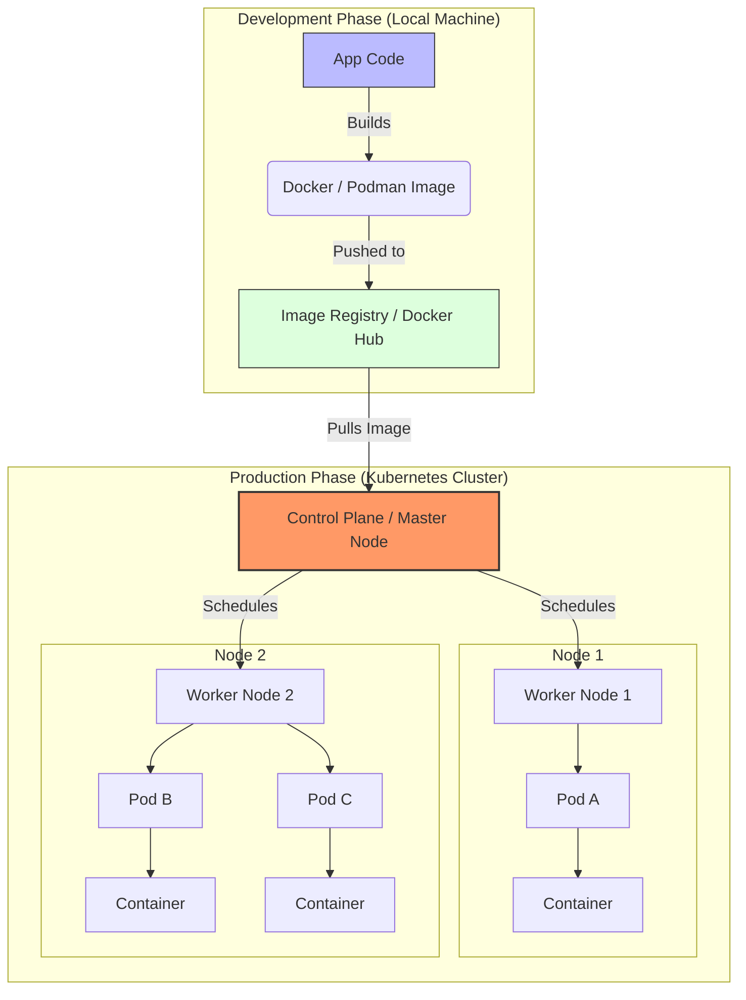

# Docker vs. Kubernetes: The Pillars of Cloud-Native Infrastructure

Docker and Kubernetes are the foundational technologies of the modern software ecosystem. While they are often mentioned together, they serve distinct, complementary roles: **Docker** packages the application, while **Kubernetes** manages the application at scale.

---

## 🐳 Docker: The Building Blocks of Containerization
Docker revolutionized engineering by providing a lightweight alternative to Virtual Machines (VMs). By sharing the host OS kernel instead of virtualizing hardware, Docker ensures applications are isolated yet highly efficient.

### How it Works
Docker utilizes two primary Linux kernel features to create isolation:
* **Namespaces:** Provide containers with their own partitioned view of the system (Process IDs, Network, etc.).
* **Control Groups (cgroups):** Manage and limit hardware resource allocation (CPU, RAM).

### Key Components
| Component | Description |
| :--- | :--- |
| **Docker Engine** | The core runtime environment that builds and executes containers. |
| **Docker Images** | Immutable, read-only templates defined by a `Dockerfile`. |
| **Docker Containers** | The live, runnable instances of an image. |
| **Docker Hub** | A centralized registry for sharing and storing container images. |

### Why We Use Docker
* **Environment Consistency:** Eliminates the "works on my machine" syndrome by mirroring dev, test, and prod environments.
* **Portability:** Containers move seamlessly across cloud providers or on-premise servers.
* **Resource Efficiency:** High application density due to low overhead compared to VMs.
* **Isolation:** Prevents dependency conflicts between different applications on the same host.

---

## ☸️ Kubernetes (K8s): Orchestrating Distributed Systems
While Docker manages individual containers, it struggles when scaling to thousands of containers across multiple servers. **Kubernetes** acts as the "brain," automating the deployment and management of these containers across a cluster.

### Core Architecture
* **Control Plane:** The orchestration engine that maintains the "desired state" of the cluster.
* **Worker Nodes:** The physical or virtual machines that execute the workloads.
* **Pods:** The smallest deployable unit; a Pod can house one or more tightly coupled containers.
* **Declarative Management:** Users define a goal (e.g., "maintain 5 replicas") in YAML, and K8s automatically works to meet that goal.

### Why We Use Kubernetes
* **Horizontal Scaling:** Automatically adjusts the number of container instances based on real-time traffic.
* **Self-Healing:** Automatically restarts crashed containers or reschedules them if a hardware node fails.
* **Service Discovery:** Provides internal IP addresses and DNS names, acting as a built-in load balancer.
* **Zero-Downtime Updates:** Manages rolling updates and instant rollbacks to ensure services stay online during deployments.

---

## 🤝 How They Work Together
The relationship is best understood through analogies: Docker containers are the **"apps,"** while Kubernetes is the **"mobile OS"** that manages them. Or, if containers are **"horses,"** Kubernetes is the **"ranch."**

### Modern Compatibility Note
> **Technical Insight:** As of version 1.24, Kubernetes deprecated `dockershim` (a direct bridge to Docker Engine). However, this **does not** mean K8s stopped supporting Docker. Because Docker produces **OCI-compliant images**, they remain fully compatible with the lightweight runtimes Kubernetes now uses, such as `containerd` or `CRI-O`.

In a typical workflow, developers use **Docker** to build and package images, then hand those images over to **Kubernetes** to handle the heavy lifting of production operations.

