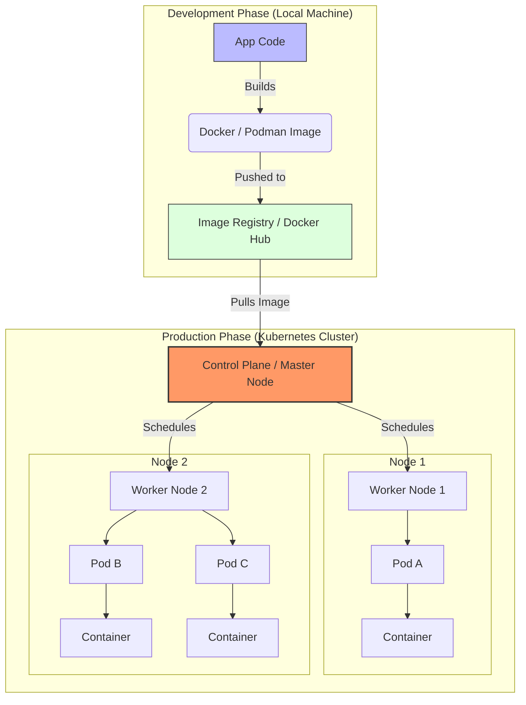

# Docker vs. Kubernetes: The Pillars of Cloud-Native Infrastructure


Docker and Kubernetes are the foundational technologies of the modern software ecosystem. While they are often mentioned together, they serve distinct, complementary roles: **Docker** packages the application, while **Kubernetes** manages the application at scale.

---

## 🐳 Docker: The Building Blocks of Containerization
Docker revolutionized engineering by providing a lightweight alternative to Virtual Machines (VMs). By sharing the host OS kernel instead of virtualizing hardware, Docker ensures applications are isolated yet highly efficient.

### How it Works
Docker utilizes two primary Linux kernel features to create isolation:
* **Namespaces:** Provide containers with their own partitioned view of the system (Process IDs, Network, etc.).
* **Control Groups (cgroups):** Manage and limit hardware resource allocation (CPU, RAM).

### Key Components
| Component | Description |
| :--- | :--- |
| **Docker Engine** | The core runtime environment that builds and executes containers. |
| **Docker Images** | Immutable, read-only templates defined by a `Dockerfile`. |
| **Docker Containers** | The live, runnable instances of an image. |
| **Docker Hub** | A centralized registry for sharing and storing container images. |

### Why We Use Docker
* **Environment Consistency:** Eliminates the "works on my machine" syndrome by mirroring dev, test, and prod environments.
* **Portability:** Containers move seamlessly across cloud providers or on-premise servers.
* **Resource Efficiency:** High application density due to low overhead compared to VMs.
* **Isolation:** Prevents dependency conflicts between different applications on the same host.

---

## ☸️ Kubernetes (K8s): Orchestrating Distributed Systems
While Docker manages individual containers, it struggles when scaling to thousands of containers across multiple servers. **Kubernetes** acts as the "brain," automating the deployment and management of these containers across a cluster.

### Core Architecture
* **Control Plane:** The orchestration engine that maintains the "desired state" of the cluster.
* **Worker Nodes:** The physical or virtual machines that execute the workloads.
* **Pods:** The smallest deployable unit; a Pod can house one or more tightly coupled containers.
* **Declarative Management:** Users define a goal (e.g., "maintain 5 replicas") in YAML, and K8s automatically works to meet that goal.

### Why We Use Kubernetes
* **Horizontal Scaling:** Automatically adjusts the number of container instances based on real-time traffic.
* **Self-Healing:** Automatically restarts crashed containers or reschedules them if a hardware node fails.
* **Service Discovery:** Provides internal IP addresses and DNS names, acting as a built-in load balancer.
* **Zero-Downtime Updates:** Manages rolling updates and instant rollbacks to ensure services stay online during deployments.

---

## 🤝 How They Work Together
The relationship is best understood through analogies: Docker containers are the **"apps,"** while Kubernetes is the **"mobile OS"** that manages them. Or, if containers are **"horses,"** Kubernetes is the **"ranch."**

### Modern Compatibility Note
> **Technical Insight:** As of version 1.24, Kubernetes deprecated `dockershim` (a direct bridge to Docker Engine). However, this **does not** mean K8s stopped supporting Docker. Because Docker produces **OCI-compliant images**, they remain fully compatible with the lightweight runtimes Kubernetes now uses, such as `containerd` or `CRI-O`.

In a typical workflow, developers use **Docker** to build and package images, then hand those images over to **Kubernetes** to handle the heavy lifting of production operations.


# Building the Cloud-Native Stack: Dockerfiles & Kubernetes Manifests

Creating the infrastructure for modern applications requires mastering two distinct declarative formats: **Dockerfiles** for packaging and **Kubernetes Manifests** for orchestration.

---

## 🐳 Mastering the Dockerfile
A **Dockerfile** is a step-by-step script that assembles a static container image. It defines the environment, dependencies, and execution parameters of your application.

### Key Instructional Concepts
* **Base Image (`FROM`):** The starting point of every image. It provides the initial OS and runtime (e.g., `node:20-alpine` or `python:3.11`).
* **Working Directory (`WORKDIR`):** Sets the active directory inside the container for all subsequent commands, similar to `cd`.
* **File Transfer (`COPY`):** Migrates source code and configuration files from your local machine into the container's filesystem.
* **Build Execution (`RUN`):** Commands executed during the image creation phase, such as `npm install` or `apt-get update`.
* **Runtime Command (`CMD`):** Specifies the default command that triggers when a container instance starts up.

### Advanced Best Practices
* **Security Context (`USER`):** A vital security step that switches the container from the default `root` user to a non-privileged user to limit the "blast radius" of a potential breach.
* **Multi-Stage Builds:** A technique using multiple `FROM` statements to separate the **build environment** (compilers, build tools) from the **production runtime**. This results in significantly smaller and more secure images.

---

## ☸️ Mastering Kubernetes Manifests
Kubernetes uses **YAML manifests** to define the "Desired State" of a cluster. These files tell the Kubernetes Control Plane exactly how resources should behave and interact.

### The Anatomy of a Manifest
A standard K8s object is defined by four primary root keys:
1.  **`apiVersion`:** Specifies the version of the Kubernetes API (e.g., `v1` or `apps/v1`).
2.  **`kind`:** Defines the resource type (e.g., `Pod`, `Deployment`, or `Service`).
3.  **`metadata`:** Contains the resource name, UID, and **Labels** used for grouping and discovery.
4.  **`spec`:** The core configuration block where the desired behavior is defined.

### Essential `spec` Fields
| Field | Purpose |
| :--- | :--- |
| **Replicas** | The specific number of identical Pod instances that should be running at all times. |
| **Selector** | A label-matching mechanism that tells a Controller (like a Deployment) which Pods it is responsible for. |
| **Template** | The "blueprint" for the Pod, including the container image, ports, and environment variables. |
| **Resource Management** | Defines **Requests** (minimum guaranteed CPU/RAM) and **Limits** (maximum allowed usage) to prevent resource exhaustion. |

### Operational & Security Controls
* **Security Policies (`securityContext`):** Hardens the container by enforcing `runAsNonRoot`, using a `readOnlyRootFilesystem`, or dropping unnecessary Linux capabilities.
* **Persistent Storage:** Uses **Volumes** and **VolumeMounts** to connect containers to persistent data sources (like `PersistentVolumeClaims`), ensuring data survives if a container restarts.

# Solving the Application Puzzle: Docker Compose & Helm

While a **Dockerfile** builds a single container, real-world applications function like a puzzle—they require a frontend, a database, and a cache to work in harmony. **Docker Compose** and **Helm** were designed to solve this "puzzle" problem at different scales.

---

## 🐙 Docker Compose: The Local Coordinator

### Why was it needed?
Before Compose, running a 3-tier application (Web + API + DB) required executing multiple, lengthy `docker run` commands manually. You had to link networks by hand and carefully time executions to ensure the database started before the API. It was a manual, error-prone process.

### What it is in detail:
Docker Compose is a **multi-container orchestrator for a single host**. It uses a `docker-compose.yml` file to define how containers interact.

* **Service Grouping:** A single command (`docker compose up`) spins up your entire application stack.
* **Automatic Networking:** It creates a private virtual network where containers communicate via service names (e.g., the API connects to `db:5432` instead of an IP address).
* **Startup Ordering:** Using the `depends_on` flag, it ensures critical infrastructure (like databases) is ready before the application tries to connect.
* **Primary Use:** Local development, automated testing (CI), and simple, single-server production deployments.

---

## ⎈ Helm: The Package Manager for Kubernetes

### Why was it needed?
Kubernetes is powerful but notoriously "wordy." Deploying one simple app requires a Deployment, Service, Ingress, Secret, and ConfigMap. 
**The Problem:** To deploy that same app to "Staging" and "Production," you would normally have to copy-paste these files and manually edit names, CPU limits, and replica counts—leading to a maintenance nightmare known as **"YAML Hell."**

### What it is in detail:
Helm is the **"Package Manager for Kubernetes"** (analogous to `npm` for Node.js). It organizes resources into packages called **Charts**.

* **Templating:** Instead of hardcoding values, you use placeholders like `{{ .Values.replicaCount }}`. You then use a single `values.yaml` file to inject different settings for different environments.
* **Versioning & Rollbacks:** Helm maintains a release history. If a new deployment fails, `helm rollback` instantly reverts the cluster to the previous working state.
* **Reusability:** You don't need to write YAML from scratch for common tools (like MySQL or Nginx); you can simply install official, pre-configured charts from the community.
* **Primary Use:** Complex production environments that require managing Dev, Staging, and Prod configurations without code duplication.

---

## 📊 Summary Comparison

| Feature | Docker Compose | Helm |
| :--- | :--- | :--- |
| **Scale** | Single Host (Your Laptop) | Multi-Node Cluster (Production) |
| **Logic** | Fixed configuration | Dynamic Templating |
| **History** | No built-in versioning | Full Versioning & Rollbacks |
| **Best For** | Development Speed | Production Reliability |

Would you like me to show you a practical example of a **Helm Template** compared to a standard **Kubernetes Manifest**?


# Comprehensive Guide: The Container & Orchestration Ecosystem

This document provides the full technical context, file structures, and detailed explanations for the modern DevOps stack, strictly formatted as a single Markdown block.

---

## 1. Docker: The Building Block
**Concept:** A `Dockerfile` is a script that packages your code, runtime, and dependencies into a single, immutable image.

### Code: `Dockerfile`
```dockerfile
# 1. Use a slim Node.js base to reduce image size
FROM node:20-alpine

# 2. Set the working directory inside the container
WORKDIR /usr/src/app

# 3. Copy package manifests first for efficient layer caching
COPY package*.json ./

# 4. Install production dependencies
RUN npm install --production

# 5. Copy the remaining application source code
COPY . .

# 6. Security: Switch from 'root' to the built-in 'node' user
USER node

# 7. Expose the application port
EXPOSE 3000

# 8. Start the application
CMD ["node", "index.js"]
```

### 1. Dockerfile Logic
**Explanation**
* **Base Image (`FROM`):** Acts as the foundation. Using `alpine` keeps the image size under 100MB, which reduces the attack surface and speeds up pull/push times.
* **Layer Caching:** By copying `package.json` before the source code, Docker only re-installs dependencies if your package manifests change, making subsequent builds significantly faster.
* **Non-Root User (`USER`):** Running as `root` is a security risk. If an attacker exploits the application, the `USER node` directive prevents them from having full control over the container host.

---

### 2. Docker Compose: The Local Coordinator
**Concept**
* **Docker Compose** manages multi-container applications (e.g., App + Database) on a single host. It is primarily used in development to ensure all team members run the exact same environment with a single command.
```dockerfile
version: '3.8'
services:
  # The Application Service
  web-app:
    build: .
    ports:
      - "8080:3000"
    environment:
      - DB_URL=db-host
    depends_on:
      - db-host

  # The Database Service
  db-host:
    image: postgres:15-alpine
    environment:
      - POSTGRES_PASSWORD=mypassword
    volumes:
      - db-data:/var/lib/postgresql/data

volumes:
  db-data:
```  

### 2. Docker Compose Logic (Continued)
**Explanation**
* **Service Networking:** Containers can talk to each other using service names as hostnames. The app connects to `db-host` automatically within the internal Docker network, eliminating the need for hardcoded IP addresses.
* **Port Mapping:** The configuration `8080:3000` maps your laptop's port `8080` to the container's internal port `3000`. This allows you to access the application via your web browser at `localhost:8080`.
* **Persistence (`volumes`):** Standard containers are ephemeral, meaning data is lost when the container is deleted. Volumes map a persistent folder on your host machine to the container so that database data survives restarts and removals.

---

### 3. Kubernetes: Production Orchestration
**Concept**
* **Kubernetes (K8s)** is a platform that manages containerized workloads across a cluster of many physical or virtual servers. It is designed for production environments to provide high availability, automated scaling, and self-healing capabilities.

```
apiVersion: apps/v1
kind: Deployment
metadata:
  name: node-deployment
spec:
  replicas: 3
  selector:
    matchLabels:
      app: web
  template:
    metadata:
      labels:
        app: web
    spec:
      containers:
      - name: node-container
        image: my-repo/node-app:v1.0
        resources:
          requests:
            cpu: "250m"
            memory: "128Mi"
          limits:
            cpu: "500m"
            memory: "256Mi"
        ports:
        - containerPort: 3000
```

### 3. Kubernetes Logic (Continued)
**Explanation**
* **Replicas:** Tells Kubernetes to ensure exactly 3 copies of the pod are running at all times. If a server node crashes, K8s automatically detects the loss and reschedules those pods onto healthy nodes to maintain availability.
* **Resource Management:** `requests` guarantee a minimum amount of CPU/RAM for the container to function, while `limits` act as a "hard ceiling" to prevent a single container from hogging all server resources and affecting other applications.
* **Declarative State:** You don't tell Kubernetes "run this command." Instead, you define the **desired state** in a YAML file, and the Kubernetes "Control Plane" constantly works in a loop to match the actual state of the cluster to your defined file.

---

### 4. Helm: The Package Manager
**Concept**
* **Helm** uses templates to make Kubernetes manifests dynamic. This allows you to define your application logic once and reuse the same code across multiple environments (Dev, Staging, and Production) simply by changing a few variables.

Code: values.yaml (The Config)

```
# Environment-specific settings
replicaCount: 5
imageTag: "prod-stable"
cpuLimit: "1000m"
```
Code: templates/deployment.yaml (The Blueprint)

```
apiVersion: apps/v1
kind: Deployment
metadata:
  name: {{ .Release.Name }}-web
spec:
  replicas: {{ .Values.replicaCount }}
  template:
    spec:
      containers:
      - name: app
        image: "my-repo/node-app:{{ .Values.imageTag }}"
        resources:
          limits:
            cpu: {{ .Values.cpuLimit }}
```

Explanation
Templating: Instead of hardcoding "5 replicas," we use {{ .Values.replicaCount }}. This allows one chart to serve every environment.

Versioning: Helm tracks "Releases." If a new deployment fails, you can run helm rollback to instantly revert to the previous working state.

Reusability: Helm allows you to share your application "package" with others, who can then install it with their own custom values.yaml file.
