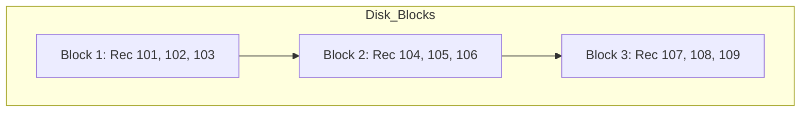

# Database Storage & Indexing: Physical Layer

This document covers the fundamental concepts of how data is physically arranged on disk and how indexes point to that data.

---

## 1. Sequential (Ordered) File Organization

In a **Sequential File Organization**, records are stored in a specific physical order based on a **search-key** (e.g., `Employee_ID`).

### Key Characteristics:
* **Physical Adjacency:** Record $n+1$ is physically stored right after record $n$.
* **Search Performance:** Extremely fast for **Range Queries** (e.g., `ID > 100 AND ID < 200`) because the disk head reads contiguous blocks.
* **Maintenance:** Deletions and Insertions are expensive because they require shifting records or managing "overflow blocks."

### Diagram: Sequential Storage

# Dense vs Sparse Index (DBMS)

## Overview

Indexing methods are categorized based on how many index entries exist
relative to the actual data records. The two primary types are **Dense
Index** and **Sparse Index**.

------------------------------------------------------------------------

# 1. Dense Index

## Definition

A dense index contains an index entry for every search-key value in the
data file.

## How It Works

-   Each record in the data file has a corresponding index entry.
-   Each index entry contains:
    -   Search key value
    -   Direct pointer to the exact record location on disk

## Characteristics

-   Direct access to records
-   No additional scanning required
-   Faster lookup performance

## Advantages

-   Very fast search
-   Direct pointer to record
-   No sequential scanning needed

## Disadvantages

-   Large index size
-   Higher storage cost
-   Higher maintenance overhead during insert/delete

## Diagram Explanation

In a dense index diagram: - Every unique ID (e.g., 10101, 12121, 15151)
appears in the index table. - Each index entry has a direct arrow
pointing to the exact row in the data file.

------------------------------------------------------------------------

# 2. Sparse Index

## Definition

A sparse index contains index entries for only some of the search-key
values.

## Requirement

-   Data file must be sorted on the search key.
-   Often one index entry per block of records.

## How It Works

-   Find the largest indexed key less than or equal to K.
-   Jump to that block location.
-   Perform sequential scan within the block to locate the exact record.

## Characteristics

-   Fewer index entries
-   Smaller index size
-   Requires additional sequential scanning

## Advantages

-   Lower storage requirement
-   Lower maintenance overhead
-   Efficient when data is block-organized

## Disadvantages

-   Slower than dense index
-   Requires sequential search after initial lookup

## Diagram Explanation

In a sparse index diagram: - Only selected keys (e.g., 10101, 32343,
76766) appear in the index. - Each index entry points to the start of a
block. - The system scans records sequentially within that block to find
the target record.

------------------------------------------------------------------------

# Comparison Table

  -----------------------------------------------------------------------
  Feature             Dense Index              Sparse Index
  ------------------- ------------------------ --------------------------
  Index Entries       One per search-key value One per block / some
                                               values

  Search Speed        Faster (direct access)   Slower (requires scan)

  Space Required      High                     Low

  Maintenance Cost    High                     Lower

  Data Requirement    No sorting required      Requires sorted data file
  -----------------------------------------------------------------------

------------------------------------------------------------------------

# Interview Summary Answer

A dense index maintains an index entry for every record, enabling fast
direct access but consuming more storage and maintenance cost.\
A sparse index maintains entries for only some records (typically one
per block), reducing storage overhead but requiring additional
sequential scanning after lookup.

------------------------------------------------------------------------

END
