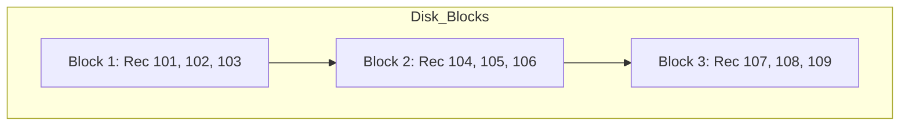
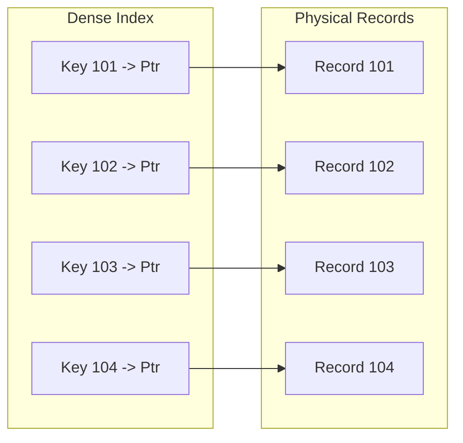
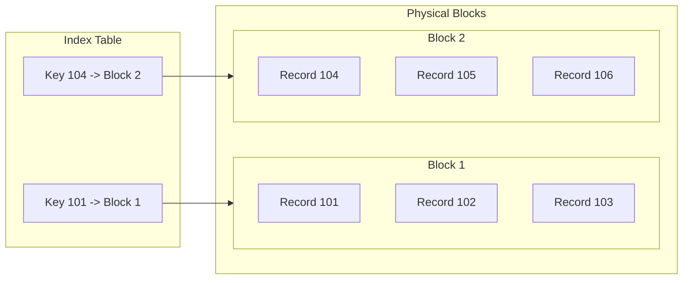
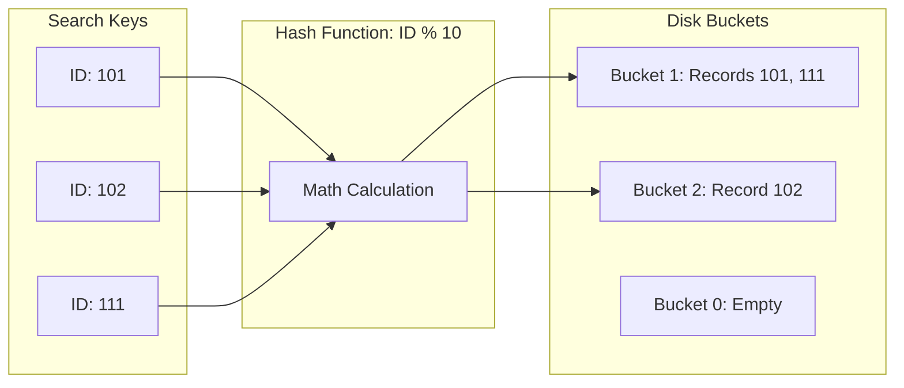
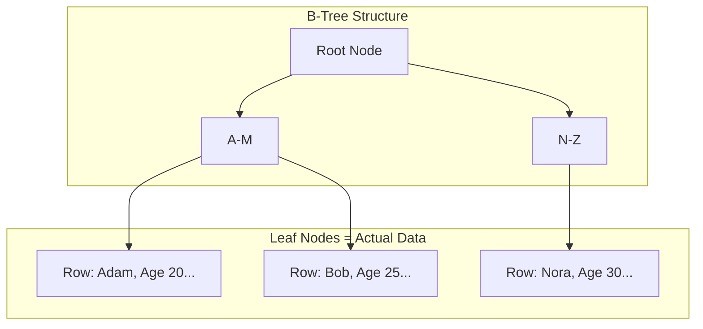
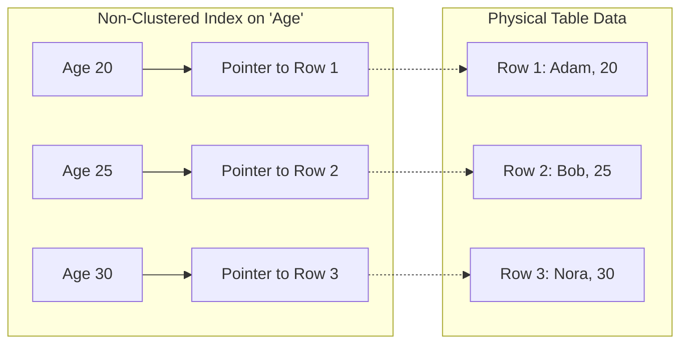
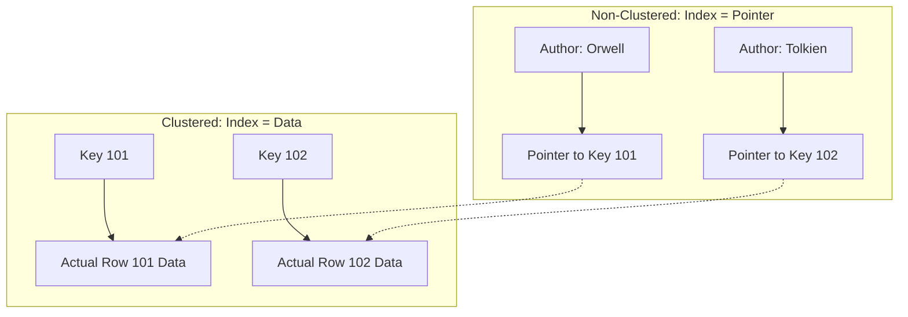
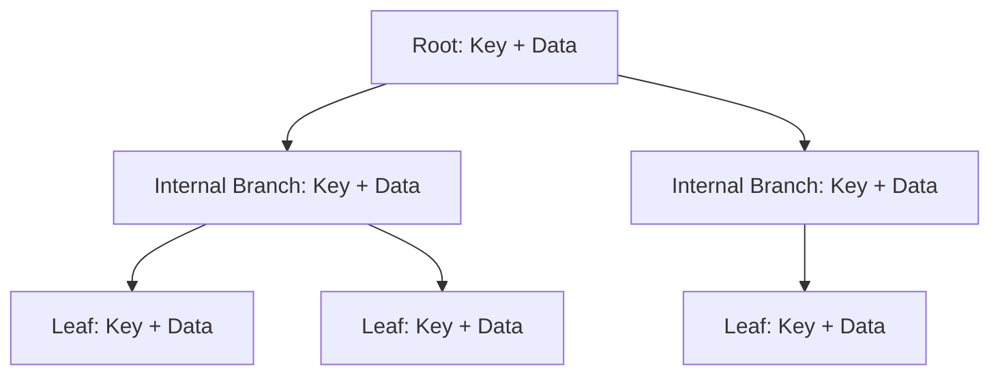
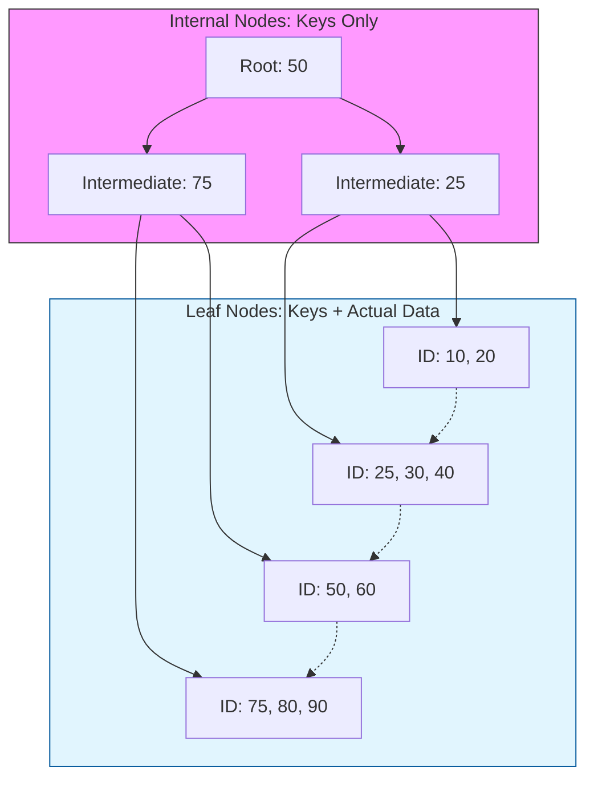

# Database Storage & Indexing: Physical Layer

This document covers the fundamental concepts of how data is physically arranged on disk and how indexes point to that data.

---

## 1. Sequential (Ordered) File Organization

In a **Sequential File Organization**, records are stored in a specific physical order based on a **search-key** (e.g., `Employee_ID`).

### Key Characteristics:
* **Physical Adjacency:** Record $n+1$ is physically stored right after record $n$.
* **Search Performance:** Extremely fast for **Range Queries** (e.g., `ID > 100 AND ID < 200`) because the disk head reads contiguous blocks.
* **Maintenance:** Deletions and Insertions are expensive because they require shifting records or managing "overflow blocks."

### Diagram: Sequential Storage

# Dense vs Sparse Index (DBMS)

## Overview

Indexing methods are categorized based on how many index entries exist
relative to the actual data records. The two primary types are **Dense
Index** and **Sparse Index**.

------------------------------------------------------------------------

# 1. Dense Index

## Definition

A dense index contains an index entry for every search-key value in the
data file.

## How It Works

-   Each record in the data file has a corresponding index entry.
-   Each index entry contains:
    -   Search key value
    -   Direct pointer to the exact record location on disk

## Characteristics

-   Direct access to records
-   No additional scanning required
-   Faster lookup performance

## Advantages

-   Very fast search
-   Direct pointer to record
-   No sequential scanning needed

## Disadvantages

-   Large index size
-   Higher storage cost
-   Higher maintenance overhead during insert/delete

## Diagram Explanation

In a dense index diagram: - Every unique ID (e.g., 10101, 12121, 15151)
appears in the index table. - Each index entry has a direct arrow
pointing to the exact row in the data file.




------------------------------------------------------------------------

# 2. Sparse Index

## Definition

A sparse index contains index entries for only some of the search-key
values.

## Requirement

-   Data file must be sorted on the search key.
-   Often one index entry per block of records.

## How It Works

-   Find the largest indexed key less than or equal to K.
-   Jump to that block location.
-   Perform sequential scan within the block to locate the exact record.

## Characteristics

-   Fewer index entries
-   Smaller index size
-   Requires additional sequential scanning

## Advantages

-   Lower storage requirement
-   Lower maintenance overhead
-   Efficient when data is block-organized

## Disadvantages

-   Slower than dense index
-   Requires sequential search after initial lookup

## Diagram Explanation

In a sparse index diagram: - Only selected keys (e.g., 10101, 32343,
76766) appear in the index. - Each index entry points to the start of a
block. - The system scans records sequentially within that block to find
the target record.



------------------------------------------------------------------------

# Interview Summary Answer

A dense index maintains an index entry for every record, enabling fast
direct access but consuming more storage and maintenance cost.\
A sparse index maintains entries for only some records (typically one
per block), reducing storage overhead but requiring additional
sequential scanning after lookup.

------------------------------------------------------------------------

# Hash File Organization

In **Hash File Organization**, the physical address of a record on the disk is determined by a mathematical formula called a **Hash Function**.

---

## 1. How it Works
Instead of searching through an index or sorting the file, the database applies a function to the **Hash Key** (usually a Primary Key) to find the "Bucket" where the record is stored.

* **Hash Function ($h$):** A formula such as $h(K) = K \pmod{n}$, where $n$ is the number of buckets.
* **Bucket:** A unit of storage (usually one or more disk blocks) that holds multiple records.

---

## 2. Diagram: Hash Mapping Process
This diagram shows how different IDs are mapped to specific disk buckets using a simple modulo function.


## 3. Key Concepts: Collisions & Overflow

> **Collision:** > Occurs when two different search keys result in the same hash value (e.g., in an `ID % 10` function, both **101** and **111** result in a hash of **1**).

> **Bucket Overflow:** > When a bucket reaches its maximum capacity, the database creates an **Overflow Chain** (a linked list of blocks). If chains become too long, the "instant" search speed advantage is lost because the database must scan the linked list.

---

## 4. Pros and Cons

| Feature | Hash File Organization |
| :--- | :--- |
| **Search Speed** | **Extremely Fast** for exact matches (Direct access via $O(1)$ complexity). |
| **Range Queries** | **Very Bad.** Since data is scattered randomly, a query like `BETWEEN 1 AND 10` requires scanning the entire file. |
| **Space Efficiency** | Can be wasteful if buckets are poorly distributed or many remain empty. |
| **Best Use Case** | Unique lookups, such as finding a user by a **Username**, **SSN**, or **Internal ID**. |

# Advanced Indexing: Clustered, Non-Clustered, and Multi-Level

## 1. Clustered Index
A **Clustered Index** defines the physical order in which data is stored in a table. 

* **The Rule:** Since data can only be sorted in one way, you can have only **one** Clustered Index per table.
* **Mechanism:** The leaf nodes of a clustered index contain the **actual data rows**.
* **Analogy:** A Phone Book. The data is physically organized alphabetically by name.

  ## DATA IS SORTED in CLUSTERED INDEX HENCE IT CN DIRECTLY POINT TO DATA OR BLOCK 
  
### Diagram: Clustered Index



## Non-Clustered Index
A Non-Clustered Index is a separate structure from the data rows. It contains the index keys and pointers (Row IDs) to the actual data.

* **The Rule:** You can have multiple non-clustered indexes on one table.

* **Mechanism:** The leaf node contains a pointer to the location of the data in the Clustered Index or a Heap file.

* **Analogy:** The Index at the back of a textbook. The "Topic" is sorted alphabetically, but it points you to a "Page Number" (the physical location).

** DATA IS UNORDERED in NON CLUSTERED INDEX HENCE IT CONTAINS a POINTER which POINTS to where actual DATA is Present **


## LAYMAN LANGUAGE - The Library Analogy

Understanding the difference between Clustered and Non-Clustered indexes is much easier when you imagine a physical library.

---

## 1. Clustered Index: "The Bookshelves"

> **Technical Definition:** The leaf nodes of a clustered index contain the **actual data rows**.

### 🏠 Layman Explanation
Imagine a library where all the books are physically placed on the shelves strictly by their **ISBN number**.

* If you want book **#105**, you go to the shelf where #104 and #106 are located.
* The **book itself** is sitting right there at that physical location.

### Why is it like this?
* **The "Index" is the "Shelf":** The physical structure of the library *is* the index.
* **One Sort Only:** You cannot physically sort the same books by ISBN and by Author Name at the same time. This is why a table can have **only one** Clustered Index.
* **Fastest Retrieval:** Once you find the correct spot on the shelf, you are holding the actual data (the book). You don't have to go anywhere else.

---

## 2. Non-Clustered Index: "The Catalog Cards"

> **Technical Definition:** The leaf node contains a **pointer** to the location of the data in the Clustered Index or a Heap file.

### 🏠 Layman Explanation
Now, imagine you want to find a book by **Author Name**, but the library is still physically sorted by ISBN. You go to the **Card Catalog** cabinet.

* You look up "George Orwell."
* The card does **not** contain the whole book. Instead, it has a **Note (Pointer)** that says: *"Go to Shelf #3, Position 402."*
* You then have to walk over to that specific shelf to get the actual book.

### Why is it like this?
* **The "Index" is a "Pointer":** It is a separate list that tells you *where* to look.
* **Multiple Indexes:** You can have many card catalogs (one for Author, one for Genre, one for Subject).
* **The "Pointer" Step:** This is slightly slower because it is a two-step process:
    1.  **Check the card** (Search the Index).
    2.  **Go to the shelf** (Retrieve the Actual Data).

---

## Summary Comparison

| Feature | Clustered (The Shelf) | Non-Clustered (The Card) |
| :--- | :--- | :--- |
| **Physical Order** | Matches the index | Does not match the index |
| **Contents** | Actual Data | Pointers to Data |
| **Quantity** | Only **One** | **Multiple** |
| **Speed** | Faster (One step) | Slower (Two steps) |







# Clustered Index: Sparse or Dense?

There is often confusion about whether a clustered index is **Sparse** or **Dense**. The answer depends on whether you are looking at classic **Database Theory** or **Modern Implementation**.

---

## 1. The Theory Perspective: Sparse
In traditional database textbooks, a **Clustered Index** is often defined as a **Sparse Index**.

* **The Logic:** Since the physical data is already sorted by the search key, the index only needs to store one entry for each **disk block** (usually the first record, known as the "anchor record").
* **The Process:** The index points the database to the correct block, and the database performs a short linear scan within that block to find the exact row.
* **Efficiency:** This keeps the index extremely small and saves memory.

---

## 2. The Modern RDBMS Perspective: Dense
In modern systems like **SQL Server, MySQL (InnoDB), and Oracle**, a Clustered Index is functionally **Dense** at the leaf level.

* **The Logic:** Modern databases use a **B+ Tree** structure. 
    * **Leaf Nodes:** The bottom level of the tree contains an entry for **every single row** in the table.
    * **Upper Levels:** The Root and Intermediate nodes act like a **Sparse Index**, directing the search to the correct leaf page.
* **The Result:** Because every row exists physically inside the leaf level of the index structure, it is considered a Dense Index.

---

## 3. Comparison Summary

| Context | Clustered Index Type | Reason |
| :--- | :--- | :--- |
| **Traditional Theory** | **Sparse** | Points to the start of a sorted data block, not every row. |
| **Modern B+ Tree DBs** | **Dense** | Every row is stored within the leaf level of the index tree. |
| **Non-Clustered Index** | **Always Dense** | Must have an entry for every row because the data is unordered (Heap). |

---

## 4. Why Non-Clustered Indexes MUST be Dense
This is a critical distinction:
1.  **Clustered Indexes** can be sparse because the data is **sequentially ordered**. If you know where "A" starts and "C" starts, you know "B" is somewhere in between.
2.  **Non-Clustered Indexes** point to unordered data (a Heap). If the index doesn't have a specific entry for "Record B," the database has no way to "guess" where it is. Therefore, every record must have a corresponding index entry.

---

## 5. Visual Representation

```mermaid
graph TD
    subgraph Theory_Sparse [Theory: Sparse Clustered]
        S1[Key 100] --> B1[Block 1: Rows 100-102]
        S2[Key 103] --> B2[Block 2: Rows 103-105]
    end

    subgraph Modern_Dense [Modern: Dense Non-Clustered]
        D1[Key 100] --> P1[Pointer to 100]
        D2[Key 101] --> P2[Pointer to 101]
        D3[Key 102] --> P3[Pointer to 102]
    end
   ``` 
## Multi-Level Indexing
As a database grows, the index itself becomes too large to fit into a single memory block. Multi-Level Indexing solves this by creating a hierarchy of indexes.

How it works:

Inner Index (Primary Index): Points to the data blocks.

Outer Index: Points to the blocks of the Inner Index.

This reduces the number of disk accesses significantly. Instead of scanning a massive index, you navigate a small "map of the map."
```mermaid
graph TD
    subgraph Level_1 [Outer Index / Root]
        Root[Entries 1 - 1000]
    end

    subgraph Level_2 [Inner Index / Intermediate]
        Root --> L2_A[1 - 500]
        Root --> L2_B[501 - 1000]
    end

    subgraph Level_3 [Leaf Nodes / Pointers]
        L2_A --> L3_1[1-100]
        L2_A --> L3_2[101-200]
        L2_B --> L3_3[501-600]
    end

    L3_1 --> Data[Actual Data Block]
```


# B-Trees vs. B+ Trees: The Simple Guide

Both B-Trees and B+ Trees are "Balanced" trees. This means the tree keeps itself symmetrical so that finding any piece of data takes roughly the same amount of time, no matter how large the database gets.

---

## 1. The B-Tree (The "All-In-One" Tree)

A B-tree is a self-balancing tree designed to handle large amounts of data. It is "balanced" because every leaf page is separated from the root by the same number of levels, ensuring consistent search times.

* **Structure:** In a B-tree, internal nodes (branches) store both **search keys** and **actual data**.
* **Early Termination:** A search might stop early if the key is found in an internal node before reaching the bottom.
* **Learned Perspective:** From a machine learning standpoint, it can be viewed as a **Regression Tree** that learns the data distribution to predict a record's position.

### B-Tree Visual Structure


## 2. The B+ Tree (The "Database Standard")

A **B+ Tree** is a variant of the B-tree specifically optimized for block-oriented storage systems, such as relational databases (e.g., **SQL Server, Oracle, and DB2**) and filesystems.

### 🔑 Key Differences
* **Data Storage:** Unlike B-trees, all actual data records (or pointers to them) are stored **exclusively in the leaf nodes**. Internal nodes (the branches) only contain search keys used for navigation.
* **Linked Leaves:** Leaf nodes are linked together in a list (usually a doubly-linked list). This allows for rapid **Range Queries** (e.g., finding all records between ID 10 and 50) because the database can simply follow the chain at the bottom level without going back up the tree.
* **Consistency:** Every search must traverse the same path length from the root to the leaf. This ensures a **predictable performance** ($O(\log n)$ complexity) for every single query.

---

### B+ Tree Structure Diagram


## 3. Operations Simplified

| Operation | Description | Complexity |
| :--- | :--- | :--- |
| **Search** | Follows a single path from the root node down to the specific leaf. | $O(\log n)$ |
| **Insertion** | Records are added to a leaf. If it overflows, the node **splits** and pushes the median key up to the parent. | $O(\log n)$ |
| **Deletion** | Records are removed from a leaf. If the leaf becomes too empty (**underflow**), it merges with a neighbor. | $O(\log n)$ |

---

## 4. Summary Comparison

| Feature | B-Tree | B+ Tree |
| :--- | :--- | :--- |
| **Data Location** | Any node (Root, Internal, or Leaf). | **Leaf nodes only.** |
| **Range Queries** | Slower (requires traversing up and down branches). | **Very Fast** (follows the linked leaf list at the bottom). |
| **Internal Node Fill** | Stores keys and actual data (takes more space). | Stores keys only (fits more keys per block/page). |
| **Standard Use** | General file systems. | **Relational Databases (RDBMS).** |
