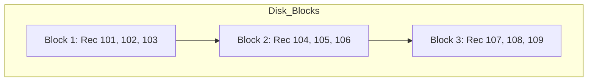
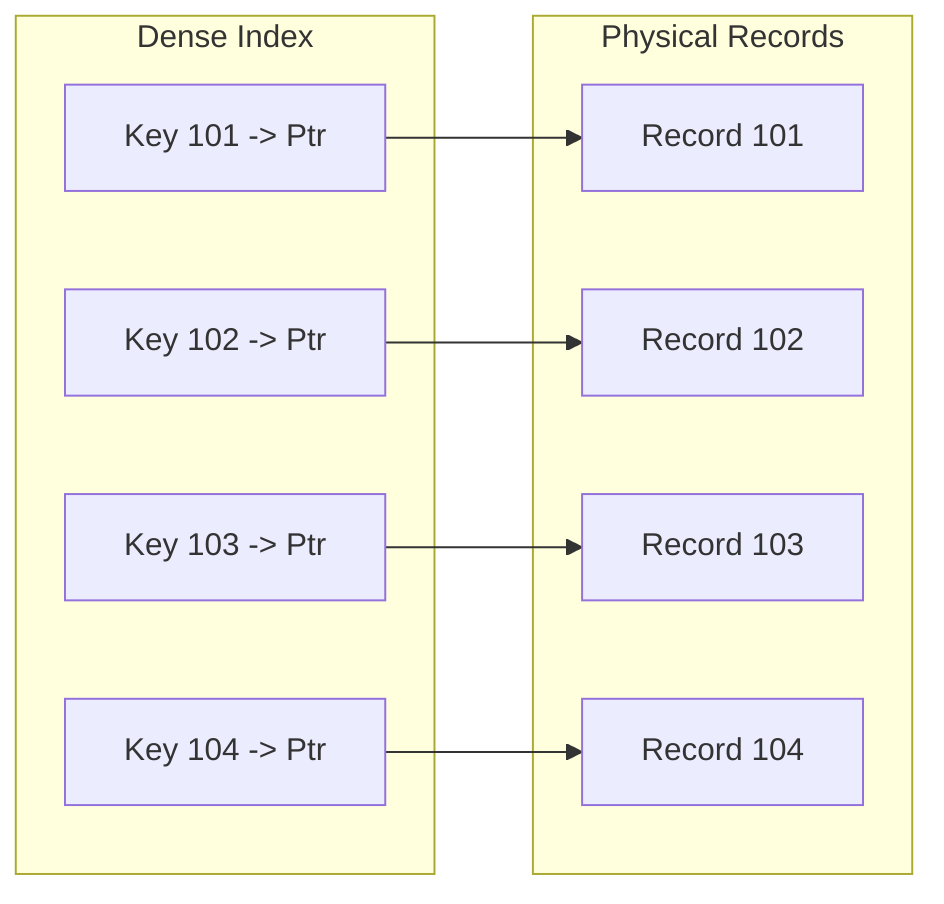
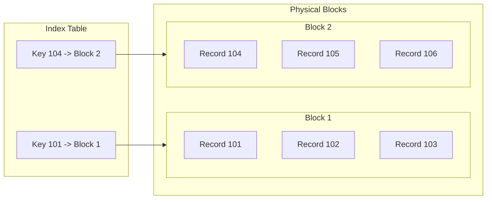
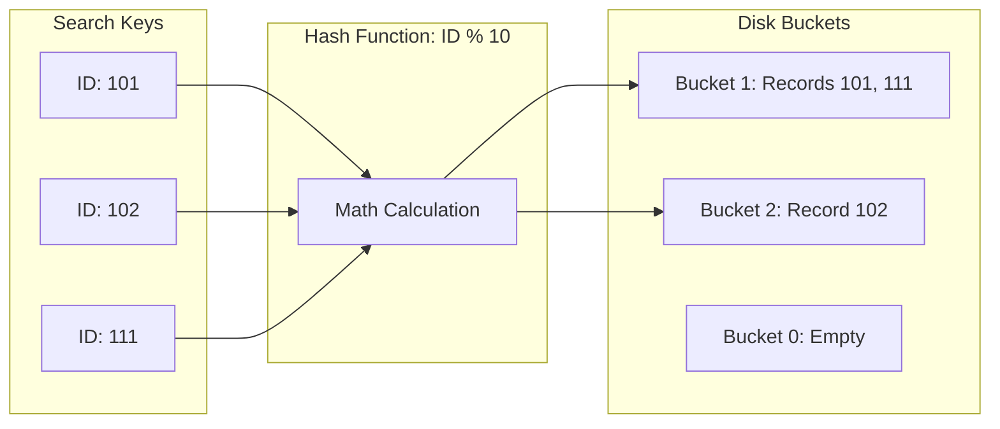
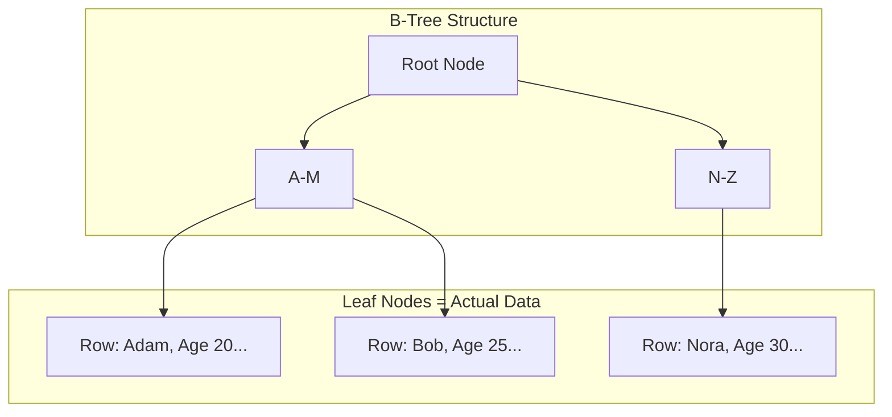
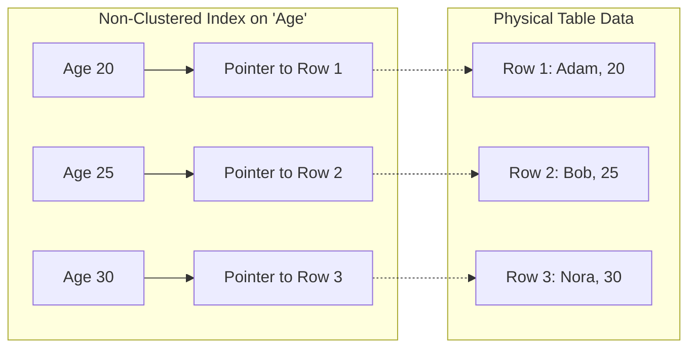
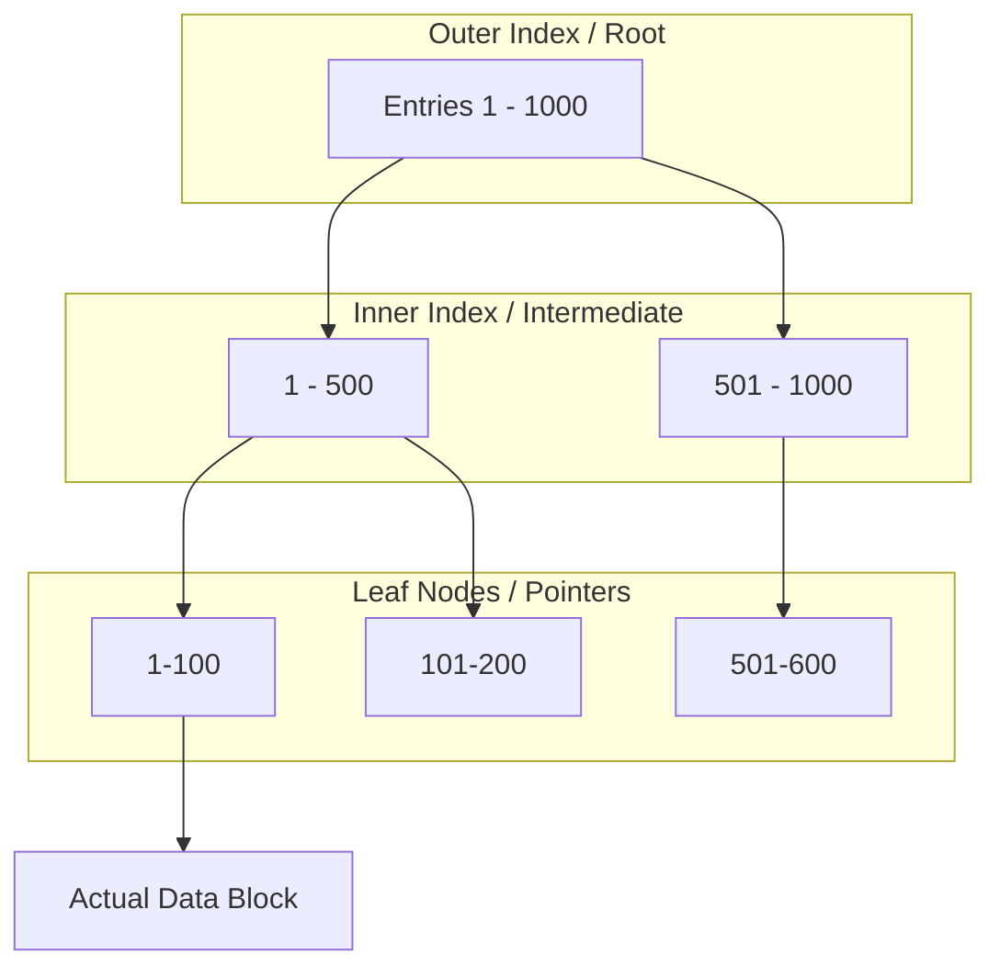

# Database Storage & Indexing: Physical Layer

This document covers the fundamental concepts of how data is physically arranged on disk and how indexes point to that data.

---

## 1. Sequential (Ordered) File Organization

In a **Sequential File Organization**, records are stored in a specific physical order based on a **search-key** (e.g., `Employee_ID`).

### Key Characteristics:
* **Physical Adjacency:** Record $n+1$ is physically stored right after record $n$.
* **Search Performance:** Extremely fast for **Range Queries** (e.g., `ID > 100 AND ID < 200`) because the disk head reads contiguous blocks.
* **Maintenance:** Deletions and Insertions are expensive because they require shifting records or managing "overflow blocks."

### Diagram: Sequential Storage

# Dense vs Sparse Index (DBMS)

## Overview

Indexing methods are categorized based on how many index entries exist
relative to the actual data records. The two primary types are **Dense
Index** and **Sparse Index**.

------------------------------------------------------------------------

# 1. Dense Index

## Definition

A dense index contains an index entry for every search-key value in the
data file.

## How It Works

-   Each record in the data file has a corresponding index entry.
-   Each index entry contains:
    -   Search key value
    -   Direct pointer to the exact record location on disk

## Characteristics

-   Direct access to records
-   No additional scanning required
-   Faster lookup performance

## Advantages

-   Very fast search
-   Direct pointer to record
-   No sequential scanning needed

## Disadvantages

-   Large index size
-   Higher storage cost
-   Higher maintenance overhead during insert/delete

## Diagram Explanation

In a dense index diagram: - Every unique ID (e.g., 10101, 12121, 15151)
appears in the index table. - Each index entry has a direct arrow
pointing to the exact row in the data file.

------------------------------------------------------------------------

# 2. Sparse Index

## Definition

A sparse index contains index entries for only some of the search-key
values.

## Requirement

-   Data file must be sorted on the search key.
-   Often one index entry per block of records.

## How It Works

-   Find the largest indexed key less than or equal to K.
-   Jump to that block location.
-   Perform sequential scan within the block to locate the exact record.

## Characteristics

-   Fewer index entries
-   Smaller index size
-   Requires additional sequential scanning

## Advantages

-   Lower storage requirement
-   Lower maintenance overhead
-   Efficient when data is block-organized

## Disadvantages

-   Slower than dense index
-   Requires sequential search after initial lookup

## Diagram Explanation

In a sparse index diagram: - Only selected keys (e.g., 10101, 32343,
76766) appear in the index. - Each index entry points to the start of a
block. - The system scans records sequentially within that block to find
the target record.

------------------------------------------------------------------------

# Interview Summary Answer

A dense index maintains an index entry for every record, enabling fast
direct access but consuming more storage and maintenance cost.\
A sparse index maintains entries for only some records (typically one
per block), reducing storage overhead but requiring additional
sequential scanning after lookup.

------------------------------------------------------------------------

# Hash File Organization

In **Hash File Organization**, the physical address of a record on the disk is determined by a mathematical formula called a **Hash Function**.

---

## 1. How it Works
Instead of searching through an index or sorting the file, the database applies a function to the **Hash Key** (usually a Primary Key) to find the "Bucket" where the record is stored.

* **Hash Function ($h$):** A formula such as $h(K) = K \pmod{n}$, where $n$ is the number of buckets.
* **Bucket:** A unit of storage (usually one or more disk blocks) that holds multiple records.

---

## 2. Diagram: Hash Mapping Process
This diagram shows how different IDs are mapped to specific disk buckets using a simple modulo function.

## 3. Key Concepts: Collisions & Overflow

> **Collision:** > Occurs when two different search keys result in the same hash value (e.g., in an `ID % 10` function, both **101** and **111** result in a hash of **1**).

> **Bucket Overflow:** > When a bucket reaches its maximum capacity, the database creates an **Overflow Chain** (a linked list of blocks). If chains become too long, the "instant" search speed advantage is lost because the database must scan the linked list.

---

## 4. Pros and Cons

| Feature | Hash File Organization |
| :--- | :--- |
| **Search Speed** | **Extremely Fast** for exact matches (Direct access via $O(1)$ complexity). |
| **Range Queries** | **Very Bad.** Since data is scattered randomly, a query like `BETWEEN 1 AND 10` requires scanning the entire file. |
| **Space Efficiency** | Can be wasteful if buckets are poorly distributed or many remain empty. |
| **Best Use Case** | Unique lookups, such as finding a user by a **Username**, **SSN**, or **Internal ID**. |

# Advanced Indexing: Clustered, Non-Clustered, and Multi-Level

## 1. Clustered Index
A **Clustered Index** defines the physical order in which data is stored in a table. 

* **The Rule:** Since data can only be sorted in one way, you can have only **one** Clustered Index per table.
* **Mechanism:** The leaf nodes of a clustered index contain the **actual data rows**.
* **Analogy:** A Phone Book. The data is physically organized alphabetically by name.

### Diagram: Clustered Index

## Non-Clustered Index
A Non-Clustered Index is a separate structure from the data rows. It contains the index keys and pointers (Row IDs) to the actual data.

* **The Rule:** You can have multiple non-clustered indexes on one table.

* **Mechanism:** The leaf node contains a pointer to the location of the data in the Clustered Index or a Heap file.

* **Analogy:** The Index at the back of a textbook. The "Topic" is sorted alphabetically, but it points you to a "Page Number" (the physical location).

## Multi-Level Indexing
As a database grows, the index itself becomes too large to fit into a single memory block. Multi-Level Indexing solves this by creating a hierarchy of indexes.

How it works:

Inner Index (Primary Index): Points to the data blocks.

Outer Index: Points to the blocks of the Inner Index.

This reduces the number of disk accesses significantly. Instead of scanning a massive index, you navigate a small "map of the map."

